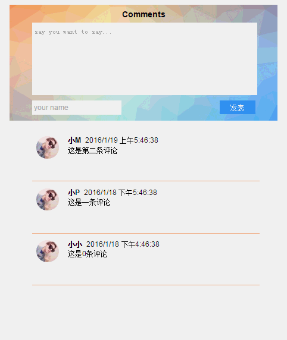

# React_CommentDemo
这是一个使用react实现的评论框组件 

##目录结构
*[1.需求](#1)
*[2.分析](#2)
*[3.编码](#3)
*[4.页面](#4)
*[5.组件](#5)
*[6.渲染](#6)

##1.需求<span id="1"></span>
实现这样一个简易的评论框组件


##2.分析<span id="2"></span>
编写React就是不断构建组件的过程，首先根据需求进行UI的划分：
-Box
    -FormBox
    -ItemBox

##3.编码<span id="3"></span>
评论框内容的处理采用了数据模拟的方式,并未和服务器交互处理<br/>
Blog/blog_data.json
```javascript
[{
    "author": "小M",
    "text": "这是第二条评论",
    "avatar": "avatar.png",
    "time": "2016/1/19 上午5:46:38"
}, {
    "author": "小P",
    "text": "这是一条评论",
    "avatar": "avatar.png",
    "time": "2016/1/18 下午5:46:38"
},{
    "author": "小小",
    "text": "这是0条评论",
    "avatar": "avatar.png",
    "time": "2016/1/18 下午4:46:38"
}]
```

##4.页面<span id="4"></span>
```html
<!DOCTYPE html>
<html lang="en">
<head>
    <meta charset="UTF-8"/>
    <title>评论框</title>
    <script src="../js/vendor/react.js"></script>
    <script src="../js/vendor/react-dom.js"></script>
    <script src="../js/vendor/jquery.min.js"></script>
    <script src="../js/vendor/JSXTransformer.js"></script>
    <link rel="stylesheet" href="blog_css.css">
</head>
<body>
    <div id="content"></div>
</body>
</html>
```

##5.组件<span id="5"></span>
**Box**
```js
var Box = React.createClass({
    getInitialState: function(){
        return {data: []}
    },
    loadFromServer: function(){
        $.ajax({
            url: this.props.url,
            dataType: "json",
            success: function(data){
                this.setState({data: data});
            }.bind(this),
            error: function(){
                console.log("出错啦!");
            }.bind(this)
        });
    },
    componentDidMount: function(){
        this.loadFromServer();
        //setInterval(this.loadFromServer, 3000);
    },
    handlerSubmit: function(t){
        this.state.data.unshift(t);
        console.log( this.state.data);
        this.setState({data: this.state.data});
        return;
    }, 
    render: function(){
        return (
            <div>
                <h3>Comments</h3>  
                <FormBox onFormSubmit={this.handlerSubmit}></FormBox>
                <ItemBox data={this.state.data}></ItemBox>
            </div>
        );
    }
});
```

**FormBox**
```js
var FormBox = React.createClass({
    handlerFormSubmit: function(e){
        e.preventDefault();
        var content = this.refs.comment.value.trim();
        var commentAuthor = this.refs.commentAuthor.value.trim();
         
        if(!content){
            alert("输入的信息不能为空啦~");
            return;
        }
        if(!commentAuthor){
            alert("请填写姓名");
            return;
        }

        var t = new Date();
        t = t.toLocaleString();
        var sj = {
            "author": commentAuthor,
            "text": content,
            "avatar": "avatar.png",
            "time": t
        }
        this.props.onFormSubmit(sj);
        this.refs.comment.value = "";
        this.refs.commentAuthor.value = "";
    },
    render: function(){
        return (
            <form method="post" className="formBox" onSubmit={this.handlerFormSubmit}>
                <textarea name="comment" className="comment" ref="comment"
                 placeholder="say you want to say..."></textarea>
                <lable className="authorName">
                <input type="text" placeholder="your name" ref="commentAuthor"/>
                </lable>
               
                <input type="submit" value="发表" className="btn" />
            </form>
        )
    }
});
```

**ItemBox**
```js
var ItemBox = React.createClass({
    render: function(){
        var itemInfo = this.props.data.map(function(t){
            return (
                <li key={t.author}>
                  <div>
                     <div className="fl">
                         
                     </div>
                     <div className="fr">
                         <span className="name">{t.author}</span>
                         <span className="time">{t.time}</span>
                         <div  className="msg">
                            {t.text}
                         </div>
                     </div>
                  </div>
               </li>
            )
        });
        return (
            <ul className="item">{itemInfo}</ul>
        )
    }
});
```

##6.渲染<span id="6"></span>
```js
ReactDOM.render(
    <Box url="blog_data.json" />,
    content
)
```
